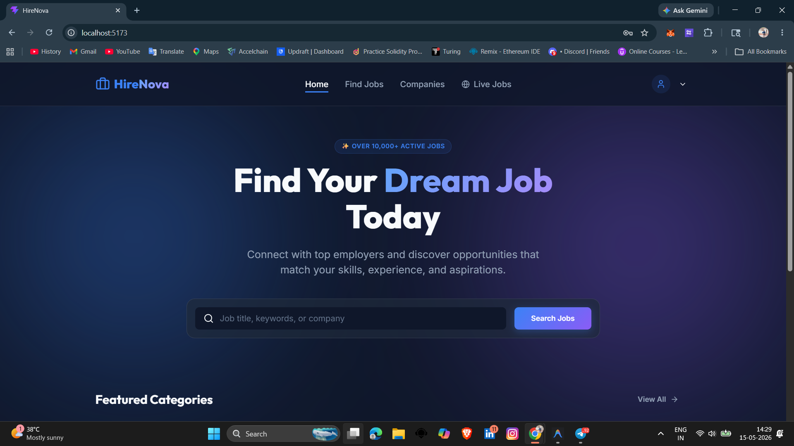
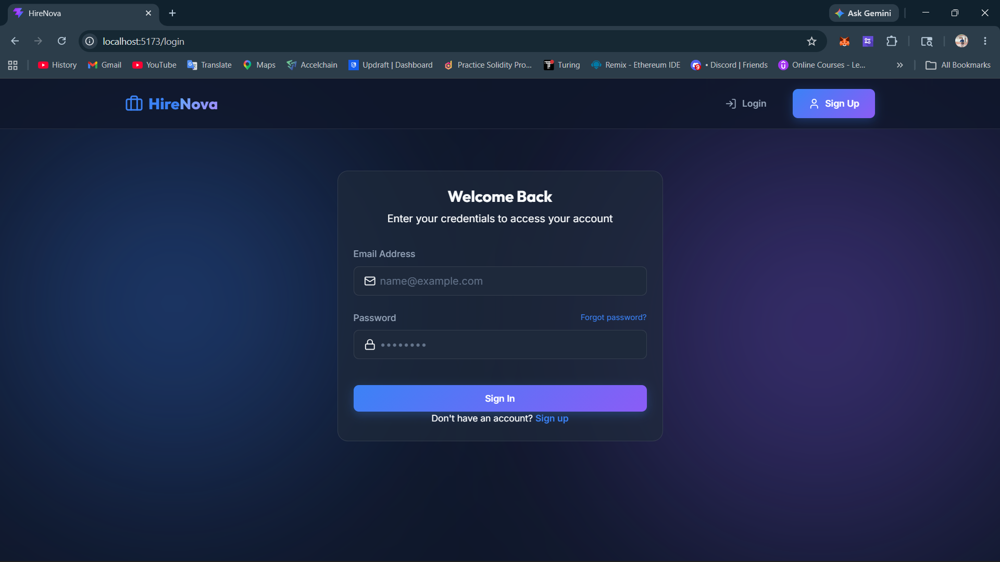
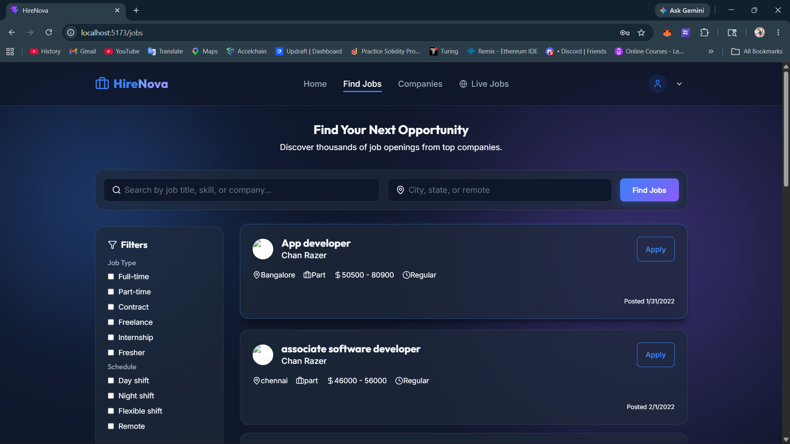
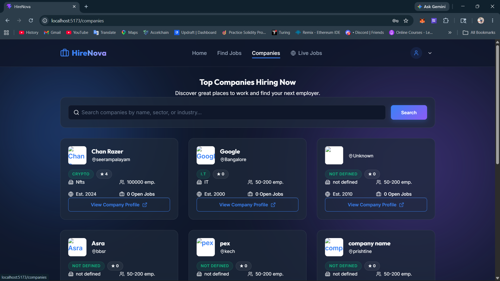
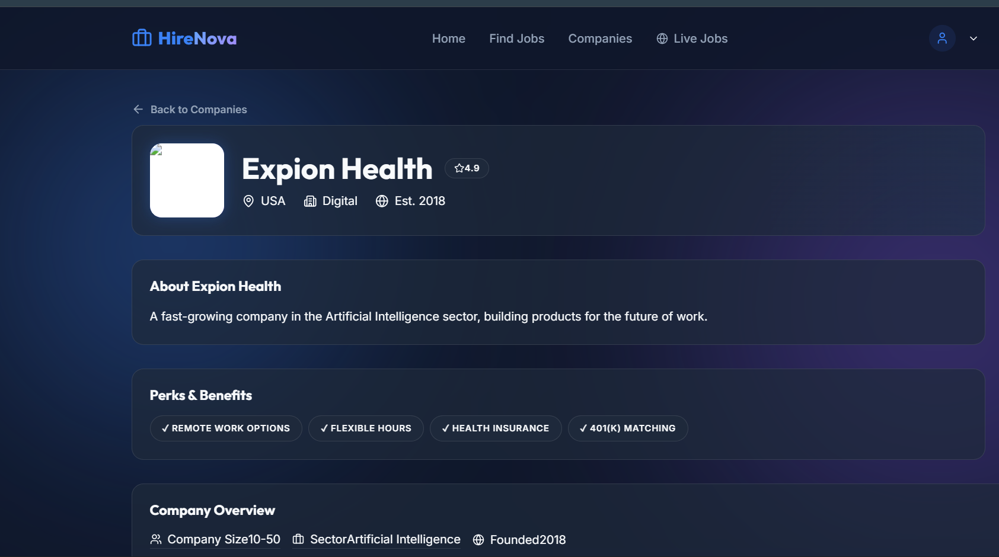
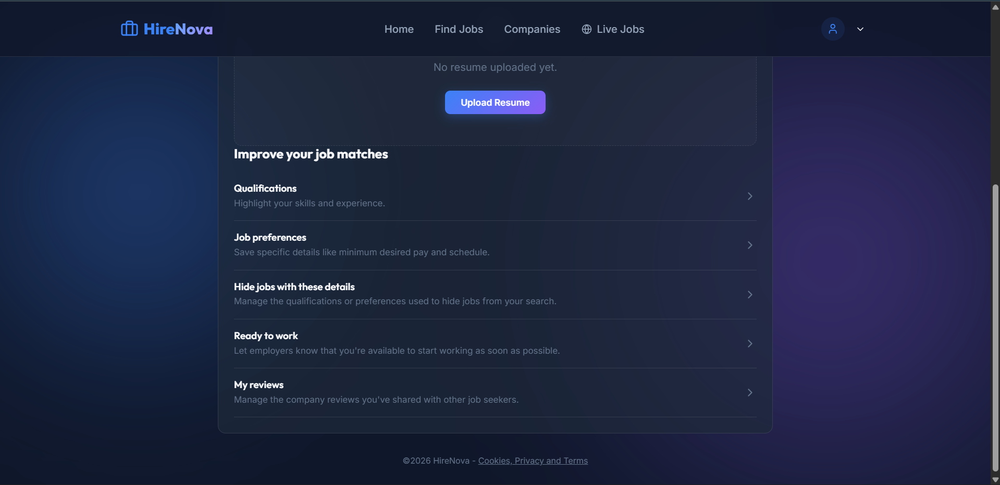
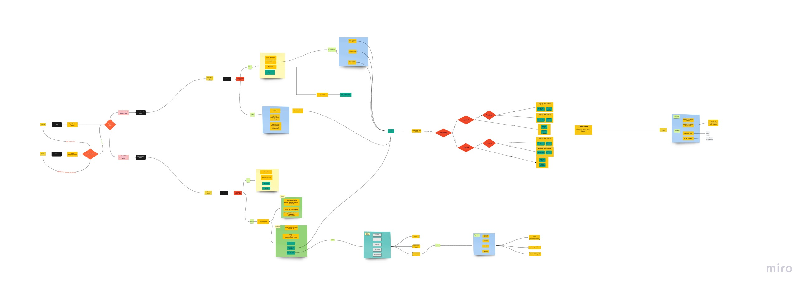
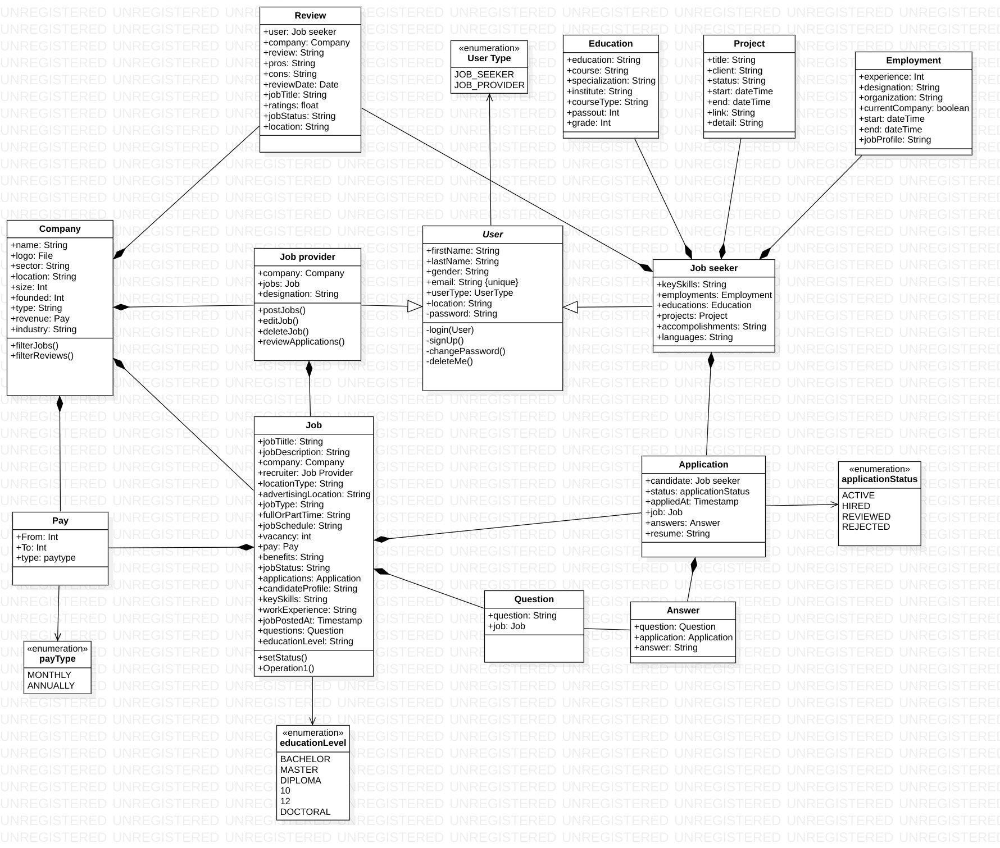
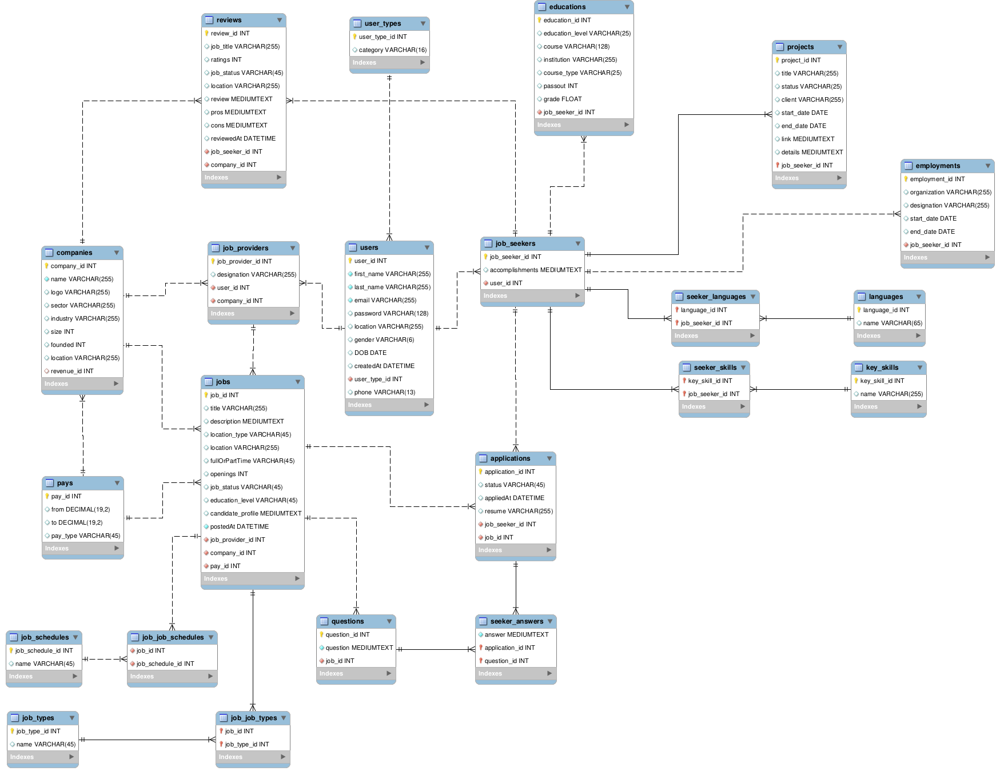

# HireNova - Premium Job Matching Platform ✨


HireNova is a modern, high-fidelity job portal designed to connect talented professionals with world-class opportunities. Featuring a sleek dark-themed interface with glassmorphism aesthetics, it provides a seamless experience for both job seekers and employers.

---

## 📸 Screenshots

### 🏠 Home Page


### 🔑 Login Page


### 💼 Find Jobs


### 🏢 Companies


### 🌍 Live Global Jobs


### 👤 User Profile


---

## 🚀 Getting Started

Follow these instructions to get the project up and running on your local machine.

### 📋 Prerequisites

Ensure you have the following installed:
*   **Node.js** (v18 or higher)
*   **Java Development Kit (JDK)** (v17 or higher)
*   **MySQL** (If running a local database)

---

## 💻 Frontend Setup (React + Vite)

The frontend is built with React and styled using vanilla CSS for maximum performance and a premium look.

1.  **Navigate to the frontend directory**:
    ```bash
    cd frontend
    ```

2.  **Install dependencies**:
    ```bash
    npm install
    ```

3.  **Run the development server**:
    ```bash
    npm run dev
    ```
    *The app will be available at `http://localhost:5173`.*

---

## ⚙️ Backend Setup (Java API)

The backend is a custom Java HTTP server that handles authentication, job matching, and database interactions.

1.  **Navigate to the root directory**:
    ```bash
    cd Job-Portal
    ```

2.  **Compile the Java files** (if not already compiled):
    ```bash
    javac -cp "lib/*" -d bin src/com/jobportal/application/*.java src/com/jobportal/application/models/*.java
    ```

3.  **Run the API Server**:
    ```bash
    java -cp "bin;lib/*" com.jobportal.application.ApiServer
    ```
    *The backend server will start on port `8080`.*

---

## 🗄️ Database Configuration

The system connects to a MySQL database. Configuration can be found in:
`src/com/jobportal/application/models/DB_VARIABLES.java`

*   **Host**: `buif8mprfkfyazp9pvrn-mysql.services.clever-cloud.com`
*   **Port**: `3306`
*   **User**: `uyna0wp8ir8ws061`

> [!NOTE]
> If you wish to use a local database, update the variables in `DB_VARIABLES.java` to point to your local MySQL instance.

---

## 🛠️ Tech Stack

*   **Frontend**: React, Vite, Lucide React (Icons), React Router
*   **Backend**: Pure Java (HTTP Server), GSON (JSON handling)
*   **Database**: MySQL
*   **Design**: Custom CSS, Glassmorphism, Dark Mode

---

## 🤝 Support

For any issues or inquiries, please contact the support team at **support@hirenova.com**.

© 2026 HireNova. Built with ❤️ for professionals worldwide.

---

## 🏗️ Architecture & Design

### 📊 Activity Flow Diagram


### 📐 Class Diagram


### 🗄️ Database Schema


